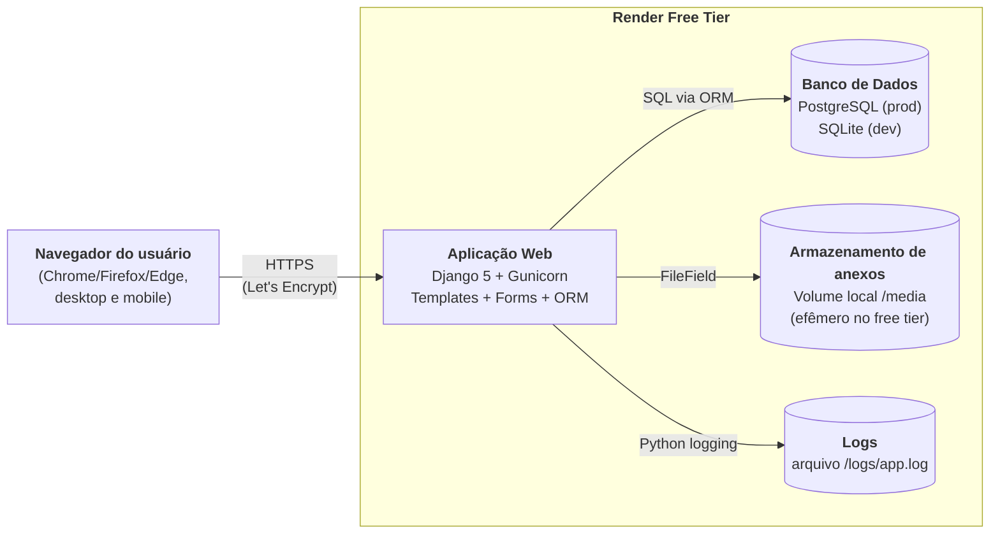
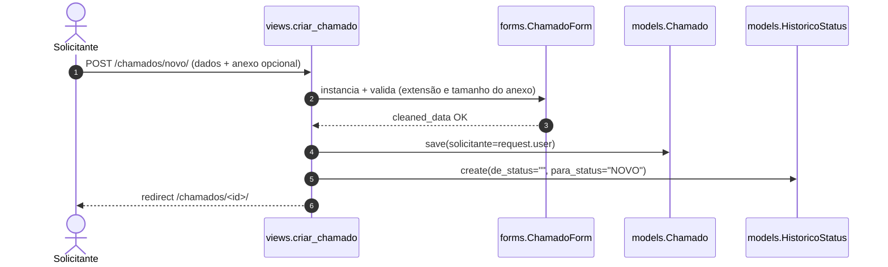
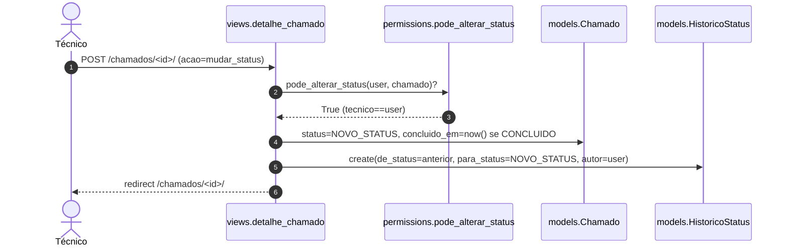

# C4 — Nível 2: Containers

Abrimos a caixa preta do "Helpdesk Labs" do nível anterior. Cada container é uma unidade de runtime independente.

## Diagrama (Mermaid)

## Containers

| Container | Tecnologia | Responsabilidade | Comunicação |
|---|---|---|---|
| **Aplicação Web** | Python 3.11+, Django 5, Gunicorn (prod) / runserver (dev) | Renderiza templates, valida formulários, aplica RBAC, expõe `/admin/` | HTTP/HTTPS para o navegador; SQL para o banco; sistema de arquivos para anexos e logs |
| **Banco de Dados** | PostgreSQL 15 (prod) / SQLite 3 (dev) | Persiste usuários, perfis, chamados, comentários, histórico, laboratórios | Driver `psycopg` (prod) ou `sqlite3` builtin (dev) |
| **Armazenamento de anexos** | Sistema de arquivos local (`MEDIA_ROOT`) | Guarda uploads de chamados | Acesso direto via `FileField.upload_to="anexos/"` |
| **Logs** | Sistema de arquivos local (`logs/app.log`) | Trilha de auditoria de eventos relevantes (login, criação, mudança de status, atribuição) | Logger `chamados` + `django.security` via handler `FileHandler` |

## Componentes principais da Aplicação Web (preview do nível 3 — Componentes)

| Componente | Caminho | Função |
|---|---|---|
| `chamados.models` | `src/chamados/models.py` | Modelos `PerfilUsuario`, `Laboratorio`, `Chamado`, `Comentario`, `HistoricoStatus` |
| `chamados.views` | `src/chamados/views.py` | Dashboard, lista, detalhe, criação, atribuição, mudança de status, relatórios |
| `chamados.forms` | `src/chamados/forms.py` | Validação de chamado, anexo, comentário, atribuição |
| `chamados.permissions` | `src/chamados/permissions.py` | `perfil_required`, `chamados_visiveis_para`, `pode_alterar_status`, `pode_comentar` |
| `chamados.signals` | `src/chamados/signals.py` | Cria `PerfilUsuario` automaticamente ao criar `User` |
| `chamados.admin` | `src/chamados/admin.py` | Painel admin nativo do Django |
| `chamados.management.commands.seed` | `src/chamados/management/commands/seed.py` | Popular dados de demonstração |

## Fluxos típicos

### Solicitante abre chamado

### Técnico altera status

## Restrições visíveis neste nível

- Sem cache distribuído (Redis/Memcached) — desnecessário em volume MVP.
- Sem fila de jobs (Celery) — todas as operações são síncronas.
- Anexos no disco local: aceitável em piloto; migrar para object storage em v2 (consequência aceita em ADR-004).
