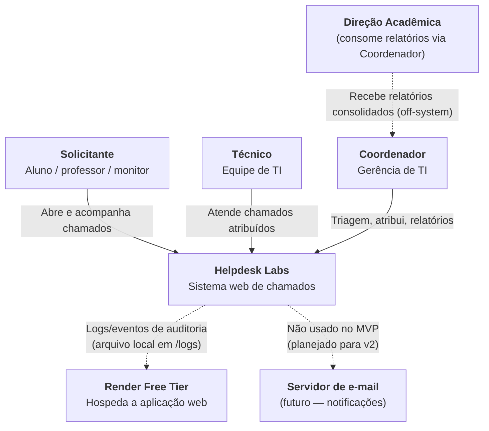

# C4 — Nível 1: Contexto

Visão de mais alto nível: quem usa o **Helpdesk Labs** e quais sistemas externos ele toca.

## Diagrama (Mermaid)

## Atores

| Ator | Descrição | Interação |
|---|---|---|
| **Solicitante** | Aluno, professor ou monitor que sofreu um problema no laboratório | Abre chamado, consulta seus chamados, comenta |
| **Técnico** | Membro da equipe de TI | Recebe chamados atribuídos, comenta, altera status |
| **Coordenador** | Gerente de TI | Vê fila completa, atribui técnicos, encerra, vê relatórios |
| **Direção acadêmica** | Não usa diretamente | Consome relatórios via coordenador |

## Sistemas externos

| Sistema | Papel no MVP | Papel futuro |
|---|---|---|
| **Render Free Tier** | Hospeda a aplicação Django + PostgreSQL + HTTPS | Permanece como provider; pode evoluir para tier pago se a carga crescer |
| **Servidor de e-mail institucional** | Não integrado no MVP | Notificações de mudança de status, atribuição (v2) |
| **SSO institucional** | Não integrado no MVP | Login social via Django Allauth (v2) |

## Fluxo principal narrativo

1. O **Solicitante** acessa o sistema via navegador (desktop ou mobile), autentica-se, descreve o problema e envia.
2. O **Coordenador** vê o chamado na fila, atribui um **Técnico**.
3. O **Técnico** atualiza status conforme atua. Comentários servem de canal de comunicação.
4. O **Coordenador** acompanha indicadores agregados na tela de Relatórios e leva o resumo para a Direção acadêmica em reuniões.

## Restrições visíveis neste nível

- Sistema único, sem APIs externas no MVP.
- Tudo acessível por HTTPS pelo Render.
- Sem integração com sistema acadêmico, CRM ou notificações externas — escopo deliberadamente reduzido.
